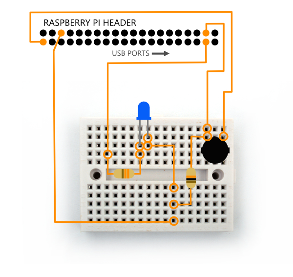
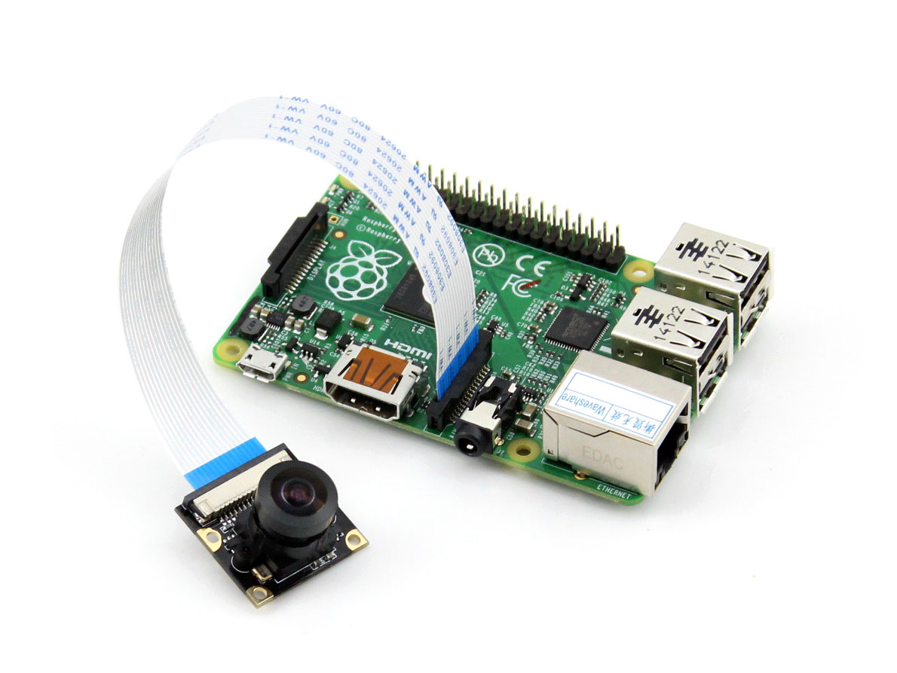
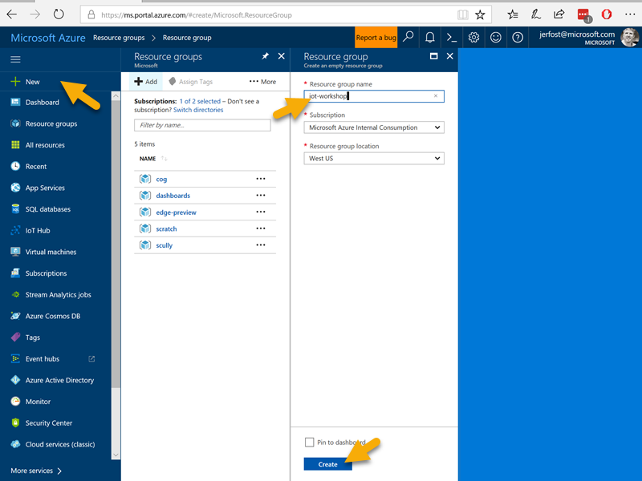
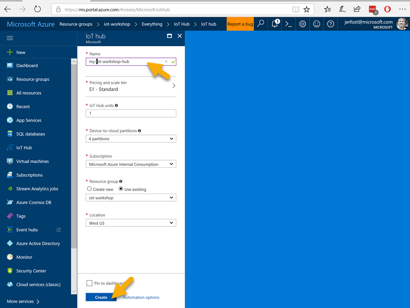

# Instructions

## Objective
This workshop will walk you through a few common IoT scenarios like basic user input (a button), output (an LED), a camera, a web service call (Microsoft Cognitive Services Vision API), and finally an IoT ingestion service (Azure IoT Hub). We'll use Node.js as the device language.

When it's all finished and working, with the click of a button you'll be able to take a picture, figure out what objects are in the picture, and then record the result in a cloud service.

## What is IoT
The Internet of Things (IoT) is a hot topic. It's also a rather broad topic, and IoT topics often cover a few disciplines...

- material design (wood, plastic, metal)
- electronics
- software
- cloud services

We won't do any material design in this project, but we'll put tother an electronic circuit, write some software, and consume some cloud services to create a fun, final solution.

## Taking Inventory
Here's what you'll need in order to complete this tutorial...

* Raspberry Pi 3
* Raspberry Pi camera module
* micro SD card
* Electronics
    * Breadboard
    * 4 M/F jumper wires
    * 2 M/M jumper wires
    * Momentary NO (normally open) button
    * LED
    * 330 &ohm; resistor
    * 10 k&ohm; resistor
* USB power cord 
* Ethernet Cable

The Raspberry Pi 3 (RP3) is obviously the brains of the operation here. It's essentially a tiny computer with controllable pins. We've equipped these ones with a Raspberry Pi camera module too. Of course, you could just plug a webcam in to one of the USB ports, but the camera module uses the CSI port on the board and is faster and has drivers built in to the device.

The RP3 doesn't have any built in storage, but uses a micro SD card slot. We have Raspbian - Raspberry Pi's custom distribution of Linux - installed along with Node.js. This makes each of these devices a very capable machine.

The RP3 is powered with a standard micro USB port.

For network connectivity, the RP3 has wifi built right in. This should already be set up for you.

BTW, there's nothing stopping you from doing this same project with a Raspberry Pi 2. It down't have built-in wifi, though, so you'd need a dongle.

You'll also need some software on your host machine. This will get you started...
* Visual Studio Code
* Node v4+
* Git
* Bonjour for Windows 

## Building the Circuit
Even basic electronic circuits can be intimidating if you - like many software devs - haven't worked with them before. The circuit for this project is very simple, and will hopefully give you some confidence.

The easiest way to direct you in putting this circuit together is to show you a breadboard diagram. Your kit has all of the components and the right number and type of jumper wires. Just follow the image below and note the following...

* In case you've never used a breadboard, what you have in your kit is a mini-breadboard. These are simpler and smaller than normal breadboards. On these boards, the columns (each with 5 holes) are connected internally, so components you plug in will be connected to each other but isolated from anything plugged in to another column.
* The 40 pins from the Raspberry Pi input/output header is displayed and the direction of the USB ports is labeled for orientation.
* The cylinder shaped components with colored lines are resistors. It doesn't matter which direction they go
* The resistors have different values, so do make sure to look at the color bands and use the correct one
* The button has four legs, because it could actually be used in two circuits simultaneously, but here we're just using it for a single circuit. When you put it in the board, the small latches should be on the _sides_ as opposed to the top and bottom.
* The direction you put the LED in _does_ matter. The longer leg is on the left.
* You can test that you have your LED in right by temporarily connecting the positive side (the leg of the resistor on the left that's connected to the LED's longer leg) to the positive (red) bus.



Additionally, there's a Raspberry Pi camera module in your kit. That camera is made especially for the Raspberry Pi. Of course, you could just plug a webcam into one of the 4 USB ports of the device, but the camera with the ribbon cable is plugging in to the camera's CSI bus and that makes it faster.

The camera in this kit is only 5 megapixels (to keep the cost low), but you can get higher quality cameras as well as cameras with IR lights to see at night!



To plug your camera connect in to your Raspberry Pi device, you use the onboard camera slot (not to be confused with the nearly identical display port!). You pull up on the plastic sleeve, insert the camera's ribbon cable with the blue side facing the USB ports, and then push down on the sleeve to secure it.

### Installing Raspbian
Installing an operating system on an IoT device is not hard, but it does take a bit of time.

We're going to be using Linux for this workshop, but you should know that *Windows 10 IoT Core* is an option too. Among its strengths, Windows 10 enables of a lot of code reuse between apps on the IoT device and apps running on other Windows platforms. If you want to install Windows 10 IoT Core, go to [windowsondevices.com](http://windowsondevices.com) to learn how.

Like I said though, we're going to be using *Linux*. Although it's possible to run various distributions on a RP3, Raspbian works great. You can choose the full version or you can go with the _Lite_ edition. The full version of Raspbian gives you the GUI desktop and a lot of apps, services, and drivers. The Lite version is best for a simple command line instance of Raspbian without all the cruft. For either one, go to [Raspberry Pi's download page](https://www.raspberrypi.org/downloads/raspbian/). The devices we're using today are using Raspbian Lite.

After you've downloaded an image, follow the [instructions](https://www.raspberrypi.org/documentation/installation/installing-images/README.md) on raspberrypi.org to get it installed on your device.

### Connecting to the Device
If you have an HDMI monitor, keyboard, and mouse available, you can plug them in to your device and use it like any other computer.

I recommend learning how to access your pi directly over a network connection and a command line, though.

To connect without a monitor, you take advantage of the fact that Raspbian comes with mDNS enabled. That means that your device is broadcasting its presence from the very first boot. To see it, you need mDNS software. If you're on a Mac, Bonjour is built in. If you're on Windows, I've found a quick install of [Bonjour Print Services](https://support.apple.com/kb/dl999) to be the easiest way. If you're on Linux, you can use [Avahi](https://en.wikipedia.org/wiki/Avahi_%28software%29), but I haven't done that before.

After you're host machine is mDNS enabled, just plug your device into your host machine using an ethernet cable, and then just ping your device using `ping <device name>.local`. When you pull a pi out of its box, its name is `raspberrypi`, so you would do `ping raspberrypi.local`. That's going to give you the IP address of the device. If it's a IPv6 address, you can request a v4 address using `ping raspberrypi.local -4`.

You can either use the newly discovered IP address to connect to your device, or you can continue using its mDNS name.

### Connecting using SSH
The first thing to do is connect remotely to your device, and SSH is the tool for the job.

You need to have ssh available on your command line. You can simply type `ssh` and then hit enter to see if you do. If you don't, you can use one of these strategies for getting it...

1. **Add the `/usr/bin` folder from your Git installation to your path.** This is the simplest method. Simply go to your machine's environment variables, edit the path, and add the folder. Mine is at `c:\Program Files\Git\usr\bin`. Once you do this (and restart your terminal), you'll have `ssh` and a bunch of other utilities at your fingertips.

1. **Install [PuTTY](https://www.chiark.greenend.org.uk/~sgtatham/putty/) (Windows).** The PuTTY application includes both a visual tool and a command line tool for remoting via SSH.

Once you have `ssh` installed, remoting to your device is as simply as `ssh pi@raspberrypi.local`.


### Configuring WiFi Networks
When you first set up a device, it doesn't know what your wireless networks are called or what your passwords are. You have to configure that. Once you do, you don't need to rely on the ethernet cable any more. Here's how to configure the networks...

1. Initiate a remote connection to the device using...
    ```
    ssh pi@raspberrypi.local
    ```
2. When prompted for the password use `raspberry`
3. Edit the wireless config file using...
    ```
    sudo nano /etc/wpa_supplicant/wpa_supplicant.conf
    ```
4. Add one to many networks to the bottom of the file using the format...
    ```
    network={
        ssid="<ssid>"
        psk="<password>"
    }
    ```
    If you want, you can add another property to multiple networks called `priority` to determine the order in which networks will be attempted. Higher numbers are tried first. That looks like this...
    ```
    network={
        ssid="MyNetwork"
        psk="pa$$w0rd"
        priority=99
    }
    ```

Now remove the ethernet cable and reboot your device with `sudo reboot now`. You can always run `wpa_cli status` to see if you're connected, and you can `ping codefoster.com` to be sure.

### Configuring the Device
There are a couple of things you need to do when you first get your device installed and get connected.

Most of the configuration options are found in a utility called `raspi-config`. To run it, use `sudo raspi-config`. I recommend checking to local to be sure it's configured for your area. It's configured for en-GB out of the box. You should also enable the camera. If you'd like, you can also go to the Advanced Options and change your hostname... especially if you're going to be using your pi on the same network with others. Otherwise, they're all called `raspberrypi` and it can get confusing.

### Installing Node on the Device
JavaScript via Node.js is just one of the languages you can write on a Raspberry Pi, but if you ask me it's the most exciting one.

There are a variety of ways to install Node on a Raspberry Pi, but the best way in my opinion is to use `nvs`. The instructions are at [https://github.com/jasongin/nvs](https://github.com/jasongin/nvs) and provide you 3 simple steps on your Pi...

```
export NVS_HOME="$HOME/.nvs"
git clone https://github.com/jasongin/nvs "$NVS_HOME"
. "$NVS_HOME/nvs.sh" install
```

Once that's done, getting the latest version of Node is as easy as...

```
nvs add latest
nvs use latest
```

Now see what version of node and npm you have by doing...

```
node -v
npm -v
```

## IoT Hub Discussion and Setup
Azure IoT Hub is sort of the center of it all. You can have millions of extremely chatty devices talking to one IoT Hub without a problem, and then you can do all sorts of fun things with those messages on the backend.
The IoT Hub service is in the cloud and needs to be created in Azure before we can write code to talk to it. 

### Creating our IoT Hub
We'll walk through the creation of an IoT Hub. This step too is very easy, but you will need an Azure subscription. If you don't have one already, go to [azure.com](http://azure.com) and click to start the free trial.

To create our hub, we'll start by creating a Resource Group. A Resource Group is a logical group of resources that often represent a single solution and are likely deployed together, managed together, and deleted together. I called mine `iot-workshop`, but you can call yours whatever you want.



Next, we'll hit the plus button above the Resources list in our Resource Group (RG) and search to find the IoT Hub resource. That will bring us to this short form to fill out.



And that's it!

### Registering a Device
We have a hub, but there has to be an explicit registration for every device that checks in to it. That's so that unauthorized code is unable to act like one of our devices and send spoofed messages.

The easiest way to register a device is to simply use the Device Explorer in the Azure portal. You simply navigate to your hub, click the Device Explorer on the left, and then click Add.

Once you have registered a device, the important bit of information is that device's _connection string_. You'll be pasting that into your code.

## Cognitive Services
Microsoft Cognitive Services is also in Azure and needs to be set up before we write the calling code.

Cognitive Services is great because it's very powerful and very easy to use. That's a good combination.

Cognitive Services is essentially a whole bunch of very complicated machine learning happening for you through a very easy to call API.

With it you can do things like detect what objects are in an image, validate that the person speaking to the computer is who they say they are, turn text into speech or speech into text, perform optical character recognition (OCR), and a ton more.

We're going to play around with the various services so you understand what all is possible, and youc an do the same thing at [microsoft.com/cognitive](http://microsoft.com/cognitive).

While you're on that site, you can click [Get started for free](https://www.microsoft.com/cognitive-services/en-us/sign-up) to get your own API keys for calling these services. 

In order to access Cognitive Services without resorting to low-level REST calls, we'll use the [http://npmjs.com/package/project-oxford](project-oxford) node module. It will be a cinch.


## Writing the Device Code
Now we need to write some code to send to our RP3. First we need to set up our project, and then we'll write the code by following these steps...

1. Connecting to the RP3's GPIO system
1. Connecting to Our IoT Hub
1. Taking a Picture
1. Analyzing the Image with Cognitive Services
1. Sending the Results to IoT Hub

Different IoT devices are capable of running different kinds of code. Lower level devices force you to write a very constrained version of C. Some run C# or Python or JavaScript. The latter choices are nice because you can work with the same kind of code on your host machine as on your device. 

Theoretically it would be possible to even run the same code on both, except that devices tend to have a number of hardware interfaces (the GPIO pins for instance) that our host machines don't have.  

We'll write the code on our host machine, and then copy it to the device.

### Setting Up the Project
Let's start by getting our project setup...

- Make yourself a new folder wherever you want on your machine called `iot-workshop`
- In that folder create another folder called `device`
- On your command line go to that `device` folder and run `npm init -y` (that will create a package.json file for you)
- Now create a `tsconfig.json` file in the project and paste in the contents from [here](http://codefoster.com/tsconfig)
- Create a file called `index.ts` and that's where we'll put our code
- Finally, open the project using Visual Studio Code by simply typing `code .` on the command line

### Pasting in the Code
I'm going to drop the entirety of the code here for you to copy, and then I'll just describe what it does.

```js
// index.ts

//IMPORTS
import * as five from 'johnny-five';
import * as raspi from 'raspi-io';
import * as Camera from 'camerapi';
import * as oxford from 'project-oxford';
import * as fs from 'fs';
import * as device from 'azure-iot-device';
import * as deviceAmqp from 'azure-iot-device-amqp';

//INIT
let cogClient = new oxford.Client('<your API key>');
let connectionString = '<device connection string>';
let hubClient = deviceAmqp.clientFromConnectionString(connectionString);

//MAIN CODE
//establishing connection to gpio
log('establishing connection to gpio...');
let board = new five.Board({ io: new raspi() });
board.on('ready', () => {
    let led = new five.Led('GPIO26');
    let button = new five.Button('GPIO20');
    led.stop().off();

    //open connection to iot hub
    log('connecting to iot hub...');
    hubClient.open(err => {
        if (err)
            log(err.message)
        else {
            log('READY');
            led.stop().off();

            let cam = new Camera();
            cam.baseFolder('.');
            button.on('press', () => {
                led.blink(500);
                log('taking a picture...');
                cam.takePicture('picture.png', (file, error) => {
                    if (error) log(error);
                    else {
                        //analyzing image
                        log('analyzing image...');
                        cogClient.vision.analyzeImage({ path: 'picture.png', Tags: true })
                            .then(result => {
                                fs.unlinkSync('picture.png'); //delete the picture

                                //sending message to iot hub
                                log('sending message to iot hub...');
                                let message = new device.Message(JSON.stringify({ deviceId: 'device1', tags: ['foo', 'baz', 'bar'] }));
                                hubClient.sendEvent(message, (err, res) => {
                                    if (err) log(err.message);
                                    else {
                                        log(`Sent ${JSON.stringify(result.tags)} to your IoT Hub`);
                                        log('READY');
                                    }
                                    led.stop().off();
                                });
                            });
                    }
                });
            })
        }
    })
})


function log(msg: string) {
    console.log(msg);
}
```

### Adding Package dependencies
You can tell from looking at the imports at the top of the file that this code has a number of dependencies.

Some of these dependencies can be installed on the host machine, but not all of them. The `raspi-io` and `camerapi` packages are expecting to be on an actual device and will fail otherwise.

So, first let's install the ones we can using...

```
npm install johnny-five project-oxford azure-iot-device azure-iot-device-amqp
```

Then, to add `raspi-io` and `camerapi` do this... 
1. In Code, locate and open the `package.json` file
1. Find the `dependencies` section
1. After the last dependency, add a comma and then...
    ```
    "raspi-io": "^6.1.0",
    "camerapi": "^0.1.0"
    ```

> **Tip** You can also hit ctrl+space and let Code autocomplete package names and versions. 

A note on why we did this. When we deploy our app out to the device, we'll send this package.json file along as well. It contains information about all of the dependencies needed by the project, and makes it easy to install all dependencies at once.

### Step 1. Connecting to the RP3's GPIO system
First, we have to get on speaking terms with the GPIO pins on our RP3.

Every IoT device implements its IO pins differently, but in most cases there are libraries already mapped to the language you want to code in. For the Raspberry Pi, check out my [article](http://codefoster.com/pi-gpio) to see specifically how it works. 

What we want is a high level library that takes away all of the ceremony for us and lets us be expressive about what we're trying to do. That's where Johnny Five comes in.

Johnny Five is a JavaScript library for working with devices. It is very popular and supports a ton of devices and hardware sensors. Furthermore, any code you write in Johnny Five is easy to port to another device type. 

Look at that code block `index.ts` and check out the part that looks like this...

 ``` js
//MAIN CODE
//establishing connection to gpio
log('establishing connection to gpio...');
let board = new five.Board({ io: new raspi() });
board.on('ready', () => {
    let led = new five.Led('GPIO26');
    let button = new five.Button('GPIO20');
    led.stop().off();
    
    ...

})

function log(msg: string) {
    console.log(msg);
}
```

### Step 2. Connecting to Our IoT Hub
To connect to the IoT Hub, we need the `azure-iot-device` and `azure-iot-device-amqp` packages that we installed.

`azure-iot-device` is a generic module for Azure IoT device code, and the second is specific to whatever IoT protocol we choose. We're choosing to use AMQP here.

Then, we drop our connection string in. Note that this is not the "IoT Hub" connection string. This is the "device connection string".

You can get this by using the IoT Hub Explorer utility again. Just do...

```
iothub-explorer list --connection-string
```

The `--connection-string` argument tells the utility to return the connection string so we can copy it.

Then we use that connection string to create our IoT Hub client. Here's the lines I'm referring to...

``` js
//INIT
let connectionString = '<device connection string>';
let hubClient = deviceAmqp.clientFromConnectionString(connectionString);
```

Next we open a connection to our IoT Hub by adding some code _inside_ the `board.on('ready', ...)` block. That's when the Johnny Five library is done setting up the device and is ready for us to talk to it.

Here's the code for connecting to IoT Hub...

``` js
//open connection to iot hub
log('connecting to iot hub...');
hubClient.open(err => {
    if (err)
        log(err.message)
    else {

        ...

    }
});

```

If the connection doesn't open, an error will be reported.

### Step 3. Taking a Picture
If you're on the command line of the Raspberry Pi, you use the `raspicam` utility to take a photo or video. We, however, are _not_ on the command line - we're in Node.js. In that case, you use a module to wrap that call to `raspicam`. The module I chose is called [`camerapi`](http://npmjs.com/package/camerapi).

To take a picture, we instantiate a new camera, set its base folder (where pictures are saved) to the current directory, and then take a picture. Here's the code...

``` js
let cam = new Camera();
cam.baseFolder('.');
cam.takePicture('picture.png', (file,error) => {

    ...

});
```

That was pretty easy. When the program is run, _after_ the board is ready and _after_ a connection to the IoT Hub is established, that code will be executed and a single picture will be taken and saved as `picture.png` in the same directory where our code is.

Now let's send that image to Microsoft Cognitive Services to see what's in it.

### Step 4. Analyzing the Image with Cognitive Services
"Project Oxford" was the code name for Microsoft Cognitive Services, and the [`project-oxford`](http://npmjs.com/package/project-oxford) module is a really good Node.js SDK for accessing it. We also need the `fs` core node module since we'll use that to read a file.

Now it's time to use that Cognitive Services key you got earlier. Put your key into the placeholder on the line that looks like...

```js
let cogClient = new oxford.Client('<your API key>');
```

Now to actually use the service to analyze an image. Here's the code...

``` js
cogClient.vision.analyzeImage({ path: 'picture.png', Tags: true })
    .then(result => {
        fs.unlinkSync('picture.png'); //delete the picture
        
        ...

    });
```  

That calls the `analyzeImage()` method passing it the name of the picture that we just took. Notice that we couldn't call this before the takePicture callback fired because that picture wouldn't exist yet. We also tell the API that we're interested in the tags by adding `Tags: true`.

Instead of using a callback, this SDK uses promises (nice!), so the function we pass to the `.then()` method is what happens after the response comes back from the service.

Here we're taking the result as is, but there's a good chance you would want to do some conditioning on that object here. We also delete the picture so we're ready for the next one.

Next we need to get that result up to an IoT Hub so we can do all kinds of cloud magic to it.

### Step 5. Sending the Results to IoT Hub

And finally, we want to send a message to the IoT Hub every time an image is successfully analyzed...

``` js
//sending message to iot hub
log('sending message to iot hub...');
let message = new device.Message(JSON.stringify({ deviceId: 'device1', tags: ['foo', 'baz', 'bar'] }));
hubClient.sendEvent(message, (err, res) => {
    if (err) log(err.message);
    else {
        log(`Sent ${JSON.stringify(result.tags)} to your IoT Hub`);
        log('READY');
    }
    led.stop().off();
});
```
This will create an IoT Hub message, send it, and handle some error cases for us. If there are no errors then it will give us a little message on the console, and whether there's an error or not, we want to stop on the LED and be sure it's in the off state using `led.stop().off()`.

That brings us to code completion! You can check out [the file](https://github.com/codefoster/iot-workshop/blob/master/device/index.ts) directly if that helps. Now we just need to get your beautiful code down to your Raspberry Pi!

## Deploying to the Device
There are many ways to deploy application code to an IoT device, but there's nothing quite as raw as simply copying the files directly over the network.

For this we need `scp`.

There are a number of files in our project now, but there are really only two that we need on our device: `index.js` and `package.json`. The `package.json` file is important, because it contains the list of dependencies our project has that we'll need to restore.

First, let's create a folder on the device to hold our project files. At your command line in your code folder, run this statement (you'll need your password)...

```
ssh <username>@<device name>.local 'mkdir device'
```
Calling `ssh` with the username@host as well as a command (i.e. 'mkdir device') issues that command on the remote device. It's a pretty handy way to fire off a command on a remote machine without the trouble of connecting, commanding, and then disconnecting.

Now run this one to copy these two files to the device...
```
scp index.js package.json <username>@<device name>.local:~/device
```

The files are out there and ready to run. I think the easiest way to run them is to open a second console window and `ssh` in directly to the device. Use...

```
ssh <username>@<device name>.local
```
Note that this command is just the `ssh` and the `username@host` so it doesn't fire a command, but rather just starts a remote session.

After your first code deployment, you'll need to restore dependencies. You can do that (once you're `ssh`'ed to the device) by using...

```
npm install
```

Now it's time to go get some coffee, because that command is going to take considerable time. There's a lot going on in the raspi-io library.

And now (still `ssh`'ed to the device) you can run your application. Normally, you run a node application using something like `node .`, but on a Raspberry Pi, it's a bit tricky. You see, your code is not allowed to access the GPIO pins unless you use `sudo`. But then if you use environment variables, using sudo doesn't respect them. Additionally, if you used `nvs` to install node like I suggested, then `sudo node` doesn't work because it doesn't see the `node` command. To resolve all of this at once, just execute...

```
sudo -E $(which node) .
```

The `-E` instructs sudo to keep your environment variables. `$(which node)` finds the exact location of the `node` command and sends that. Finally, `.` means "this folder". Node is smart enough to look for an `index.js` file in the current folder and run that.

If all went as planned, your code shoudl be running, and you should se "READY". To test it, push the button and see what happens!

One more note here. I hooked some timing up to this code and discovered that it takes a full 6s to take the picture. I'm not sure why it takes that long. The entire process takes close to 10s on my machine, where the vast majority of the rest of the time is spent sending the image to the cloud and analyzing it. Sending a message to IoT Hub takes very little time. The message is small and the AMQP protocol is a very efficient one.

That's great and all, but perhaps we want to see what messages are landing in our hub. For that we would write a simple service to monitor hub messages. We can write and run this service on our host machine. It doesn't have to be running in Azure or on the device.

## Writing the Hub Listener Code
We'll write one more Node project, connect it to our IoT Hub, and simply report to the console whenever we see messages appear in the hub.

The only real reason for this part is to show you how you would write a custom service that responds to messages as they arrive in the cloud. Actually, there's a decent chance you won't even _need_ a custom service since you can wire up IoT Hub to a number of other Azure services with configuration alone. But just in case.

Follow these steps on your host machine...
- in the `iot-workshop` folder that you created earlier, create another folder called `hublistener`.
- in that `hublistener` folder on your command line run `npm init -y`. That creates the `package.json` file.
- run `npm install azure-event-hubs --save`
- create an `index.ts` file
- create a `tsconfig.json` file (use the content from [codefoster.com/tsconfig](http://codefoster.com/tsconfig))

Now edit that `index.ts` file (to open the project in code, just type `code .`)

Here are the file contents...

``` js
//index.ts
import * as eh from 'azure-event-hubs'

let connectionString = '<IoT Hub connection string>';
var hubClient = eh.Client.fromConnectionString(connectionString);

hubClient.open()
    .then(hubClient.getPartitionIds.bind(hubClient))
    .then(pids => 
        pids.map(pid => 
            hubClient.createReceiver('$Default', pid, { 'startAfterTime': Date.now() })
                .then(receiver => {
                    console.log('Created partition receiver: ' + pid)
                    receiver.on('errorReceived', err => console.log(err.message));
                    receiver.on('message', m => console.log(JSON.stringify(m.body)));
                })
        )
    )
    .catch(err => console.log(err.message));
```

That first line imports the `azure-event-hubs` package. I haven't mentioned this yet, but IoT Hub is implemented with an Azure Event Hub, and every IoT Hub has an Event Hub endpoint. That means that an IoT Hub can _act_ like an Event Hub. We're using the `azure-event-hub` package here because we only want to _read_ from hub and are not actually going to be sending any cloud-to-device (C2D) messages.

We start with the connection string. This is the _IoT Hub_ connection string (as opposed to the device connection string), and we discover by navigating to our IoT Hub in our Azure portal and looking at the "Shared access policies" section. We'll choose the `service` policy, and then copy the primary connection string.

Once we've created the `hubClient` we call `open()` and _then_ (this uses the promise pattern) we get the partition IDs (we may have configured our hub to use any number of partitions between 2 and 32 or even more), and _then_ we create a receiver for each partition, and then we tie up some event handlers for that receiver including what to do when it sees a message. In that case, we simply log it to the console. 

We can run this (on our host machine) using `node .` at the command line in the `hublistener` folder. You'll see the messages that it's connecting and creating partition receivers, and then if you go send a message from your device, you should see it in the hublistener. Very cool!

We're successfully sending messages to the cloud, but now what? We're slowly collecting data about everything a camera sees, and now we would likely want to do something in the cloud with that data. Maybe we want to report it with some graphs. Maybe we want to create an alert for any time a certain thing is spotted. Maybe we want to send an email whenever the incident count of a _certain_ object is seen a _certain_ number of times.

> **Oh, the possibilities are endless!**
