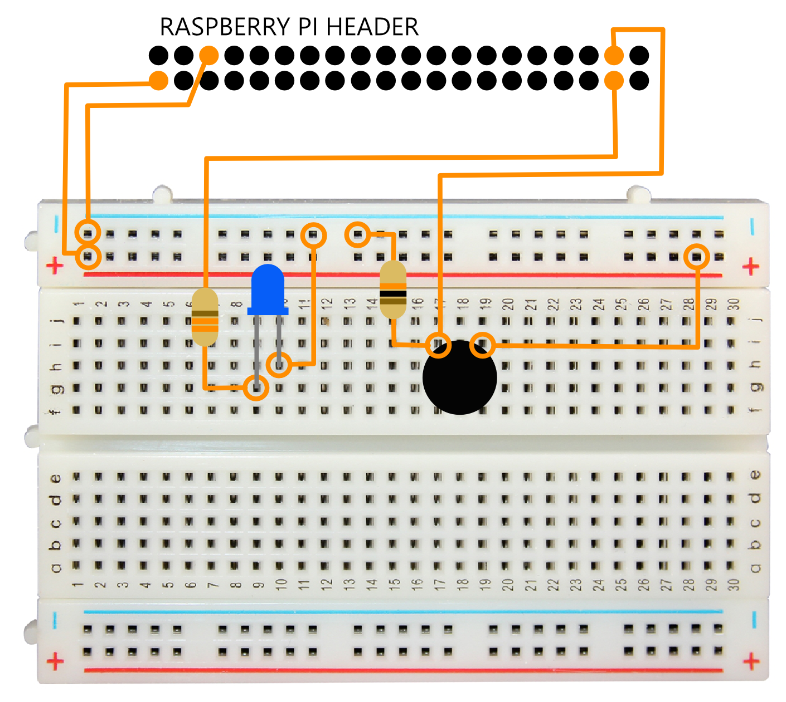

check case of all headers to be consistent
insert images

# Instructions
## Why we are here  
Lets create a project that allows us to touch a button, take a picture, analyze what's in the picture, and send that data to the cloud.

By the end of this workshop, you should feel comfortable with...
    1) Installing Raspian (all the different ways)
    1) Communicating with the Raspberry Pi Headless 
    1) Understanding the GPIO and how to work with them
    1) prototying with breadbords (simple schematics at least )
    1) Communicating with a camera device (raspicam, ffmpeg, etc )
    1) Using SSH and SCP to work with the Pi
    1) Getting Familiar with node, and npm
    1) Having a basis for a cool IoT idea (show them waterrower and Wackcoon) 
    1) Azure Iot Hub and Cognitive Services

All of this in just 65 lines of code.

## What is IoT
Internet of Things (IoT) projects are made up of...
- material design (wood, plastic, metal)
- electronics
- software
- cloud services

## Taking Inventory
Here's what you should have in your kit...

* Raspberry Pi 3
* Raspberry Pi camera module
* SD card
* Electronics
    * Breadboard
    * Wires
    * Push button
    * LED
    * 330 &ohm; resistor
    * 10 k&ohm; resistor

What you need to pick up from up front
    * USB Cord for powered
    * Power Brick 
    * Ethernet Cable ( Dont need a crossover )

The Raspberry Pi 3 (RP3) is obviously the brains of the operation here. It's essentially a tiny computer with controllable pins. We've equipped these ones with a Raspberry Pi camera module too. Of course, you could just plug a webcam in to one of the USB ports, but the camera module uses the CSI port on the board and is faster and has drivers built in to the device.

The RP3 doesn't have any built in storage, but uses an SD card slot. We have Raspbian - Raspberry Pi's custom distribution of Linux - installed along with Node.js. This makes each of these devices a very capable machine.

The RP3 is powered with a standard micro-USB port. We don't have micro-USB cables provided, so we're hoping you have your own.

For network connectivity, the RP3 has wifi built right in. This should already be set up for you.

## Building the Circuit


## Prerequisites (can be found on USB sticks)
* Visual Studio Code
* Node v6+
* Git (for scp - add git bin path or use bash on Windows) to copy files from computer to raspberry pi
* Bonjour for Windows 


### Installing Raspbian
Installing an operating system on an IoT device is not hard, but it does take a bit of time, so *these devices are all done for you*.

If you were going to do it yourself, here would be how you'd get started with that.

We're going to be using Linux for this workshop, but you should know that *Windows 10 IoT Core* is an option too. It's a generally easy and well-curated platform that's capable of a lot of code reuse between apps on the IoT device and apps running on other Windows platforms. If you want to install Windows 10 IoT Core, go to [windowsondevices.com](http://windowsondevices.com) to learn how.

Like I said though, we're going to be using *Linux* for this. Although it's possible to run various distributions on a RP3, Raspbian works great. You can choose the full version or you can go with the _Lite_ edition. The full version of Raspbian gives you the GUI desktop and a lot of apps, services, and drivers. The Lite version is best for a simple command line instance of Raspbian without all the cruft. For either one, go to [Raspberry Pi's download page](https://www.raspberrypi.org/downloads/raspbian/). The devices we're using today are using Raspbian Lite.

### Installing Node
Like the operating system, *Node has already been installed for you*.

If you're following these instructions on your own device though, you'll want to know how to get started with that, so let's go.

There are a variety of ways to install Node on a Linux device. A Raspberry Pi is a bit of a special condition, because it's an ARM processor and many of the versions of Node.js were never built for ARM. The more current versions all support it fine, though, so you'll be in good shape.

Another consideration is which _version_ of Node.js you need. We're going to be using v4.4.7, but that's only because there's one silly dependency deep down in our project that doesn't play will with newer versions. I'll mention later how you can even install multiple versions and quickly switch between them if you'd like.

So, I'll mention the other ways I know of to install Node and then tell you my favorite.

* You can set your apt-get registries correctly, update apt-get, and then do a `sudo apt-get install nodejs nodejs-legacy`. The awkward thing there is that in Ubuntu's package store Node.js is called `nodejs`... not `node`. That's why the `nodejs-legacy` package is required. It gives you the ability to type `node` on the command line and get what you expect.
* You can install NVM (Node Version Manager) and then use it to install one or more versions of Node.js and easily and quickly switch between them. This method burned me on a Raspberry Pi once though because it left an old version of Node which was still being referenced by the device's GPIO pins. I wasted a lot of time on that problem. Details [here](http://codefoster.com/pi-oldnode) in case you care.
* Finally, you can simply wget the bits you know you need for your architecture, put them in the right place, and set your links. Like this...

    ```
    wget http://nodejs.org/dist/v4.4.7/node-v4.4.7-linux-armv7l.tar.xz
    tar -xf node-v4.4.7-linux-armv7l.tar.xz
    sudo mkdir /usr/local/node
    sudo mv node-v4.4.7-linux-armv7l /usr/local/node/v4.4.7
    cd /usr/local/bin
    sudo ln -sf /usr/local/node/v4.4.7/bin/node node
    sudo ln -sf /usr/local/node/v4.4.7/bin/npm npm
    node -v
    npm -v
    ```

    The `wget` line downloads it.
    
    The `tar` line decompresses it.
    
    The `sudo mv` line puts it in the right place.
    
    And the `ln` commands set up your links for both node and npm.

    By the way, you can download multiple versions of node and put them all in the `/usr/local/node` folder side by side and then just run the `ln` commands to change your pointers to the version you want at any given time. 

### Setting up WiFi without a monitor

## Talk about typescript

## IoT Hub Discussion and Setup
### Creating our IoT Hub
Azure IoT Hub is sort of the center of it all. You can have millions of extremely chatty devices talking to one IoT Hub witihout a problem, and then you can do all sorts of fun things with those messages on the backend.

We'll walk through the creation of an IoT Hub. This step too is very easy, but you will need an Azure subscription. If you don't have one already, go to [azure.com](http://azure.com) and click to start the free trial.

To create our hub, we'll start by creating a Resource Group. A Resource Group is a logical group of resources that often represent a single solution and are likely deployed together, managed together, and deleted together. I called mine `iot-workshop`, but you can call yours whatever you want.

{ image }

Next, we'll hit the plus button above the Resources list in our Resource Group (RG) and search to find the IoT Hub resource. That will bring us to this short form to fill out.

{ image }

And that's it!

### Registering a Device
We have a hub, but there has to be an explicit registration for every device that checks in to it. That's so that unauthorized code is unable to act like one of our devices and send spoofed messages.

Let's use the `iothub-explorer` utility to add a device. It's oh so easy.

First install it...

```
npm install -g iothub-explorer
```

Now go to your Azure Portal and get your `iothubowner` shared access policy connection string.

{ image }

Now log in to IoT Hub Explorer using that connection string like this...

```
iothub-explorer login '<connection string>'
```

And finally, you can register a device...

```
iothub-explorer create '<device id>'
```

## Getting Set Up with Cognitive Services
Microsoft Cognitive Services is great because it's very powerful and very easy to use. That's a good combination.

Cognitive Services is essentially a whole bunch of very complicated machine learning happening for you through a very easy to call API.

With it you can do things like detect what objects are in an image, validate that the person speaking to the computer is who they say they are, turn text into speech or speech into text, perform optical character recognition (OCR), and a ton more.

We're going to play around with the various services so you understand what all is possible, and youc an do the same thing at [microsoft.com/cognitive](http://microsoft.com/cognitive).

While you're on that site, you can click [Get started for free](https://www.microsoft.com/cognitive-services/en-us/sign-up) to get your own API keys for calling these services. 

In order to access Cognitive Services without resorting to low-level REST calls, we'll use the [http://npmjs.com/package/project-oxford](project-oxford) node module. It will be a cinch.


## Writing the Device Code
Now we need to write some code to send to our RP3. First we need to set up our project, and then we'll write the code by following these steps...

1. Connecting to the RP3's GPIO system
1. Connecting to Our IoT Hub
1. Talking to GPIO
1. Taking a Picture
1. Analyzing the Image with Cognitive Services
1. Sending the Results to IoT Hub

Different IoT devices are capable of running different kinds of code. Lower level devices force you to write a very constrained version of C. Some run C# or Python or JavaScript. The latter choices are nice because you can work with the same kind of code on your host machine as on your device. 

Theoretically it would be possible to even run the same code on both, except that devices tend to have a number of hardware interfaces (the GPIO pins for instance) that our host machines don't have.  

We're going to use TypeScript for this workshop because...

- it's awesome
- it's easy
- it gets us in the habit of writing ES6 code

We'll write the code on our host machine and then copy it to the device.

Before I start walking you through each of the blocks of code, let me just show you all the code at once. I know that tends to help me understand the breadth of what I'm about to tackle. Here it is...

```js
// index.ts

import * as five from 'johnny-five';
import * as raspi from 'raspi-io';
import * as Camera from 'camerapi';
import * as oxford from 'project-oxford';
import * as fs from 'fs';
import * as device from 'azure-iot-device';
import * as deviceAmqp from 'azure-iot-device-amqp';

let cogClient = new oxford.Client('d7889254b9244ec1ba54e8cf154ff359');
let connectionString = 'HostName=iot-workshop-hub.azure-devices.net;DeviceId=device1;SharedAccessKey=zyislRKCFj5k916xvNRyB0JPihQpad/56tzTMZMWpdk=';
let hubClient = deviceAmqp.clientFromConnectionString(connectionString);

//establishing connection to gpio
log('establishing connection to gpio...');
let board = new five.Board({ io: new raspi() });
board.on('ready', () => {
    let led = new five.Led('GPIO26');
    let button = new five.Button('GPIO20');
    led.stop().off();

    //open connection to iot hub
    log('connecting to iot hub...');
    hubClient.open(err => {
        if (err)
            log(err.message)
        else {
            log('READY');
            led.stop().off();

            let cam = new Camera();
            cam.baseFolder('.');
            button.on('press', () => {
                led.blink(500);
                log('taking a picture...');
                cam.takePicture('picture.png', (file, error) => {
                    if (error) log(error);
                    else {
                        //analyzing image
                        log('analyzing image...');
                        cogClient.vision.analyzeImage({ path: 'picture.png', Tags: true })
                            .then(result => {
                                fs.unlinkSync('picture.png'); //delete the picture

                                //sending message to iot hub
                                log('sending message to iot hub...');
                                let message = new device.Message(JSON.stringify({ deviceId: 'device1', tags: ['foo', 'baz', 'bar'] }));
                                hubClient.sendEvent(message, (err, res) => {
                                    if (err) log(err.message);
                                    else {
                                        log(`Sent ${JSON.stringify(result.tags)} to your IoT Hub`);
                                        log('READY');
                                    }
                                    led.stop().off();
                                });
                            });
                    }
                });
            })
        }
    })
})


function log(msg: string) {
    console.log(msg);
}
```

There you have it. You could just copy and paste all of that and you'd be done, but that would be cheating. You're here to learn. So let's break it down and paste in one functional unit at a time.

### Setting Up the Project
Let's start by getting our project setup...

- make yourself a new folder wherever you want on your machine called `iot-workshop`
- in that folder create another folder called `device`
- on your command line go to that `device` folder and run `npm init -y` (that will create a package.json file for you)
- now create a `tsconfig.json` file in the project and paste in the contents from [here](http://codefoster.com/tsconfig)
- finally, create a file called `index.ts` and that's where we'll put our code

{ talk about creating the package.json, tsconfig.json, and index.ts }

### Step 1. Connecting to the RP3's GPIO system
First, let's get on speaking terms with the GPIO pins on our RP3.

Every IoT device implements its IO pins differently, but in most cases there are libraries already raised up to the language you want to write in. For the Raspberry Pi, check out my [article](http://codefoster.com/pi-gpio) to see specifically how it works. 

What we want is a high level library that takes away all of the ceremony for us and lets us be expressive about what we're trying to do. That's where Johnny Five comes in.

Johnny Five is a JavaScript library for working with devices. It is very popular and supports a ton of devices and hardware sensors. Furthermore, any code you write in Johnny Five is easy to port to another device type. 

We first need to use `npm` to install a couple of dependencies for our project.

Go to your command prompt, make sure you're in the `device` folder, and run this...

```
npm install johnny-five raspi-io --save
```

That's going to take considerable time. There's a lot going on in the raspi-io library.

Now, go to your IDE and edit the `index.ts` file and let's start by wiring up IoT Hub. We need a couple of imports...

``` js
import * as five from 'johnny-five';
import * as raspi from 'raspi-io';
```

And below that add the code for setting up your device...

``` js
//establishing connection to gpio
log('establishing connection to gpio...');
let board = new five.Board({ io: new raspi() });
board.on('ready', () => {
    let led = new five.Led('GPIO26');
    let button = new five.Button('GPIO20');
    led.stop().off();

    ...

})
```

### Step 2. Connecting to Our IoT Hub
To connect to the IoT Hub, we need to install and them import a couple more packages. So, at the command line do...

```
npm install azure-iot-device azure-iot-device-amqp --save
```

And then add this to the top of our `index.ts` file...
``` js
import * as device from 'azure-iot-device';
import * as deviceAmqp from 'azure-iot-device-amqp';
```


The first is a generic module for Azure IoT device code, and the second is specific to whatever IoT protocol we choose. We're choosing to use AMQP here.

Now we'll drop our connection string in. Note that this is not the "IoT Hub" connection string. This is the "device connection string".

You can get this by using the IoT Hub Explorer utility again. Just do...

```
iothub-explorer list --connection-string
```

The `--connection-string` argument tells the utility to return the connection string so we can copy it.

Then we'll use that connection string to create our IoT Hub client.

``` js
let connectionString = '<device connection string>';
let hubClient = deviceAmqp.clientFromConnectionString(connectionString);
```

Now we can open a connection to our IoT Hub...

``` js
hubClient.open(err => {
    if (err) console.log(err)
    else {
        //happy path
    }
})
```

And if the connection doesn't open, an error will be reported. The rest of our code should go there in the happy path.

### Step 3. Talking to GPIO

### Step 4. Taking a Picture
If you're on the command line of the Raspberry Pi, you use the `raspicam` utility to take a photo or video. If you're writing an application in Node.js, however, you use a module to wrap that call to `raspicam`. The module I chose is called [`camerapi`](http://npmjs.com/package/camerapi).

Import the `camerapi` module using an ES6 `import` statement. It's good convention to always put your imports at the top of your code file...

``` js
import * as Camera from 'camerapi';
```
Again, we need to do the actual install, so at your command line do...

```
npm install camerapi --save
```

Now, where I put `//happy path` you instantiate a new camera, set its base folder (where pictures are saved) to the current directory, and then take a picture like this...

``` js
let cam = new Camera();
cam.baseFolder('.');
cam.takePicture('picture.png', (file,error) => {
    //happy path    
});
```

That was pretty easy. When the program is run, after a connection to the IoT Hub is established (a connection we're not using yet by the way), that code will be executed and a single picture will be taken and saved as `picture.png` in the same directory where our code is.

Let's move on now to sending that image to Microsoft Cognitive Services to see what's in it.

### Step 5. Analyzing the Image with Cognitive Services
Up at the top of your file add another import to bring in the [`project-oxford`](http://npmjs.com/package/project-oxford) module. _Project Oxford_ was the code name for Microsoft Cognitive Services and is a really good Node.js SDK. You also need an import for the `fs` core node module since we'll use that to read a file.

``` js
import * as oxford from 'project-oxford';
import * as fs from 'fs';
```

And install `project-oxford` from the command line. The `fs` module is built in to node and doesn't need to be installed...

```
npm install project-oxford --save
```

Now it's time to use that Cognitive Services key you got earlier. Paste this code in somewhere below the project-oxford import and replace the key...

```js
let cogClient = new oxford.Client('<your API key>');
```

Now to actually use the service to analyze an image. Inside your `takePicture` callback where I put `//happy path`, add...

``` js
cogClient.vision.analyzeImage({ path: 'picture.png', Tags: true })
    .then(result => {
        fs.unlinkSync('picture.png'); //delete the picture
        //happy path
    });
```  

That calls the `analyzeImage()` method passing it the name of the picture that we just took. Notice that we couldn't call this before the takePicture callback fired because that picture wouldn't exist yet. We also tell the API that we're interested in the tags by adding `Tags: true`.

Instead of using a callback, this SDK uses promises (nice!), so the function we pass to the `.then()` method is what happens after the response comes back from the service.

Here we're taking the result as is, but there's a good chance you would want to do some conditioning on that object here. We also delete the picture so we're ready for the next one.

Next we need to get that result up to an IoT Hub so we can do all kinds of cloud magic to it.

### Step 6. Sending the Results to IoT Hub

And finally, we want to send a message to the IoT Hub every time an image is successfully analyzed. Add the following to the happy path...

``` js
let message = new device.Message(JSON.stringify({ deviceId: 'device1', tags: result.tags }));
hubClient.sendEvent(message, (err, res) => {
    if (err) console.log(err);
    else console.log(`Sent ${JSON.stringify(result.tags)} to your IoT Hub`);
    hubClient.close((err, res) => {
        if (err) console.log(err);
    })
});
```
This will create an IoT Hub message, send it, and handle some error cases for us.

You're code complete now! You can check out [my whole file](https://github.com/codefoster/iot-workshop/blob/master/device/index.ts) to make sure you didn't miss anything. Now we just need to get your beautiful code down to your Raspberry Pi!

## Transpiling our TypeScript
We're writing this code using TypeScript. Surely you noticed that our file extensions are `.ts`, and perhaps you also noticed that our code contains modern ES6 syntax. Modern versions of Node.js are certainly capable of handling ES6, but they don't know what to do with `.ts` files. We need to _transpile_ these into `.js` files.

This sounds complicated, but far from it. Visual Studio Code is inherently capable of doing this.

First, you need to install the `typescript` npm package. At your command prompt type `npm install -g typescript`. That installs the TypeScript tooling (compiler and more) globally, so you can do things like type `tsc` anywhere and turn `.ts` files into `.js` files.

Once TypeScript is installed, go back to VS Code and hit `ctrl + shift + b` (build). Your first time running the `build` command, Code will ask you to configure your task runner. Go ahead and hit `Configure Task Runner` and then choose `TypeScript - Watch Mode`. 
Watch mode means that Code will silently watch in the background for any `.ts` files to change and will automatically transpile those to `.js` for you, so you only need to hit `ctrl + shift + b` once per Code session.

## Deploying to the Device
There are many ways to deploy application code to an IoT device, but there's nothing quite as raw as simply copying the files directly over the network.

For this we need `scp`.

There are a number of files in our project now, but there are really only two that we need on our device: `index.js` and `package.json`. If you don't remember creating `index.js` that's because you didn't. TypeScript made that for you when you transpiled. The `package.json` file is important, because it contains the list of dependencies our project has that we'll need to restore.

First, let's create a folder on the device to hold our project files. At your command line in your code folder, run this statement (you'll need your password)...

```
ssh <username>@<device name>.local 'mkdir device'
```
Calling `ssh` with the username@host as well as a command (i.e. 'mkdir device') issues that command on the remote device. It's a pretty handy way to fire off a command on a remote machine without the trouble of connecting, commanding, and then disconnecting.

Now run this one to copy these two files to the device...
```
scp index.js package.json <username>@<device name>.local:~/device
```

The files are out there and ready to run. I think the easiest way to run them is to open a second console window and `ssh` in directly to the device. Use...

```
ssh <username>@<device name>.local
```
Note that this command is just the `ssh` and the `username@host` so it doesn't fire a command, but rather just starts a remote session.

After your first code deployment, you'll need to restore dependencies. You can do that (once you're `ssh`'ed to the device) by using...

```
npm install
```

And now (still `ssh`'ed to the device) you can run your application using...

```
node .
```

The `.` means "this folder". Node is smart enough to look for an `index.js` file in the current folder and run that.

If all went as planned, you should be taking pictures, cogging them, and sending them to IoT Hub.

You might want to leave this `ssh` console up, because so far this program just takes a single picture when it's run and then the process exits. To take another picture, just fire `node .` again. We may very well want to do something fancier like program this to happen on an interval until we kill the process or maybe even wire a button up to the RP3 to take a picture when we press it.

One more note here. I hooked some timing up to this code and discovered that it takes a full 6s to take the picture. I'm not sure why it takes that long. The entire process takes close to 10s on my machine, where the vast majority of the rest of the time is spent sending the image to the cloud and analyzing it. Sending a message to IoT Hub takes very little time. The message is small and the AMQP protocol is a very efficient one.

That's great and all, but perhaps we want to see what messages are landing in our hub. For that we would write a simple service to monitor hub messages. We can write and run this service on our host machine. It doesn't have to be running in Azure or on the device.

## Writing the Hub Listener Code
We'll write one more Node project, connect it to our IoT Hub, and simply report to the console whenever we see messages appear in the hub.

Follow these steps on your host machine...
- in the `iot-workshop` folder that you created earlier, create another folder called `hublistener`.
- in that `hublistener` folder on your command line run `npm init -y`. That creates the `package.json` file.
- run `npm install azure-event-hubs --save`
- create an `index.ts` file
- create a `tsconfig.json` file (use the content from [codefoster.com/tsconfig](http://codefoster.com/tsconfig))

Now edit that `index.ts` file (to open the project in code, just type `code .`)

I'll just give you the entire file contents at once this time and then explain it...

``` js
import * as eh from 'azure-event-hubs'

let connectionString = '<connection string>';
var hubClient = eh.Client.fromConnectionString(connectionString);

hubClient.open()
    .then(hubClient.getPartitionIds.bind(hubClient))
    .then(pids => 
        pids.map(pid => 
            hubClient.createReceiver('$Default', pid, { 'startAfterTime': Date.now() })
                .then(receiver => {
                    console.log('Created partition receiver: ' + pid)
                    receiver.on('errorReceived', err => console.log(err.message));
                    receiver.on('message', m => console.log(JSON.stringify(m.body)));
                })
        )
    )
    .catch(err => console.log(err.message));
```

That first line imports the `azure-event-hubs` package. I haven't mentioned this yet, but IoT Hub is implemented with an Azure Event Hub, and every IoT Hub has an Event Hub endpoint. That means that an IoT Hub can _act_ like an Event Hub. We're using the `azure-event-hub` package here because we only want to _read_ from hub and are not actually going to be sending any cloud-to-device (C2D) messages.

We start with the connection string. This is the _IoT Hub_ connection string (as opposed to the device connection string), and we discover by navigating to our IoT Hub in our Azure portal and looking at the "Shared access policies" section. We'll choose the `service` policy, and then copy the primary connection string.

Once we've created the `hubClient` we call `open()` and _then_ (this uses the promise pattern) we get the partition IDs (we may have configured our hub to use any number of partitions between 2 and 32 or even more), and _then_ we create a receiver for each partition, and then we tie up some event handlers for that receiver including what to do when it sees a message. In that case, we simply log it to the console. 

We can run this (on our host machine) using `node .` at the command line in the `hublistener` folder. You'll see the messages that it's connecting and creating partition receivers, and then if you go send a message from your device, you should see it in the hublistener. Very cool!

We're successfully sending messages to the cloud, but now what? We're slowly collecting data about everything a camera sees, and now we would likely want to do something in the cloud with that data. Maybe we want to report it with some graphs. Maybe we want to create an alert for any time a certain thing is spotted. Maybe we want to send an email whenever the incident count of a _certain_ object is seen a _certain_ number of times. The possibilities are endless. But regardless, there's a good chance that you want to start with a Stream Analytics job. 


